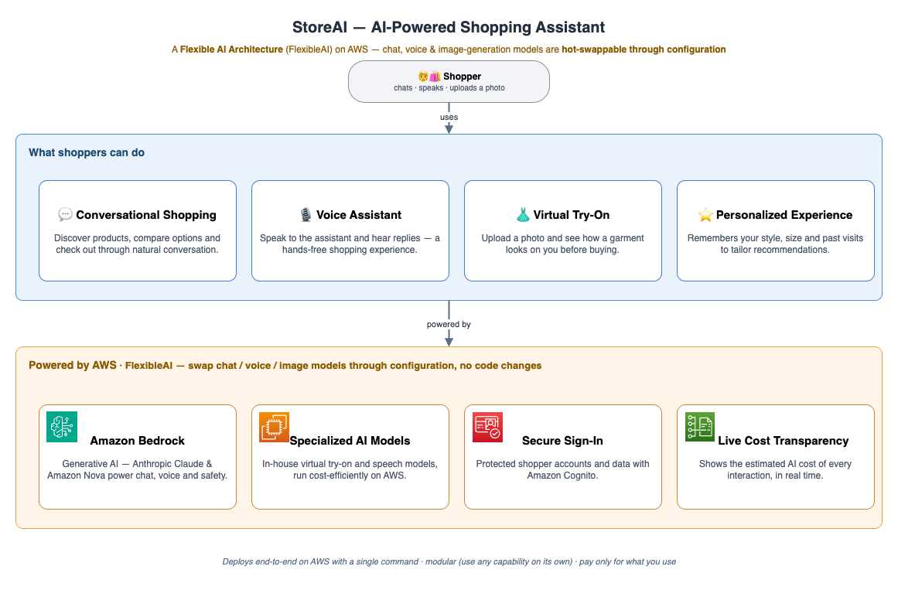

# StoreAI

StoreAI is an AI-powered retail shopping assistant you can deploy end to end on AWS with a single
command. Shoppers chat or talk with an assistant that understands natural language, recommends
products, and shows how clothing looks on them through virtual try-on — all in one web experience.

This repository is a **comprehensive reference architecture**: a complete, working system you can
deploy, study, and adapt. It shows how to combine large language models, real-time voice, and image
generation into a cohesive product on [Amazon EKS](https://aws.amazon.com/eks/) and
[Amazon Bedrock](https://aws.amazon.com/bedrock/).



## What it does

- **Conversational shopping** — a multi-agent assistant ([Anthropic Claude](https://www.anthropic.com/claude)
  on Amazon Bedrock) helps shoppers discover products, compare options, and check out through natural
  conversation.
- **Voice interaction** — shoppers can speak to the assistant and hear replies, using
  [Amazon Nova Sonic](https://aws.amazon.com/ai/generative-ai/nova/) for speech-to-text and
  text-to-speech, or [Whisper](https://huggingface.co/openai/whisper-large-v3) for speech-to-text.
- **Virtual try-on** — shoppers upload a photo and see themselves wearing a garment, generated by a
  choice of image models ([FASHN](https://huggingface.co/fashn-ai/fashn-vton-1.5) on GPU, or
  [Qwen Image-Edit](https://huggingface.co/Qwen/Qwen-Image-Edit) on
  [AWS Trainium](https://aws.amazon.com/ai/machine-learning/trainium/)).
- **Related-product suggestions** — the assistant recommends other products in the same category as
  the one a shopper is viewing.
- **Personalized memory** — returning signed-in shoppers are remembered across sessions (style
  preferences, sizes, past purchases) via [Amazon S3 Vectors](https://aws.amazon.com/s3/features/vectors/),
  so the assistant can tailor recommendations on a later visit.
- **Live cost transparency** — the UI shows the estimated AI cost of each interaction and a running
  session total, broken down by category (chat, try-on, speech-to-text) with a separate
  infrastructure estimate.
- **Optional animated avatar** — an on-screen presenter powered by [HeyGen](https://www.heygen.com/).

## Why it exists

Building a shopping assistant that is conversational, multimodal, and cost-aware normally means
stitching together many services by hand. StoreAI packages that integration work into a modular,
config-driven system built around a **FlexibleAI** approach (config-driven, hot-swappable model
backends) — chat, voice, and image-generation models are pluggable and swappable through
configuration — so you can:

- Deploy the whole store, or just one capability (for example, only virtual try-on), with one command.
- Swap AI models in and out through configuration, without changing application code.
- Use it as a starting point for your own retail, voice, or generative-AI project.

## Quick start

You need an AWS account, the AWS CLI, and a few standard tools (see
[docs/getting-started.md](docs/getting-started.md) for the full list and setup).

```bash
# 1. Describe what you want to deploy (or accept the defaults)
./deploy/storeai config init

# 2. Deploy the full stack
./deploy/storeai up
```

When the deployment finishes, the CLI prints your store URL:

```
StoreAI is live: https://d1234abcdef.cloudfront.net
```

The deployment also creates the Cognito admin sign-in user — and **no password is stored in config**.
If you set a real `prerequisites.auth.adminEmail`, Cognito emails a one-time invitation and you set
your own password on first sign-in. If you leave it blank, it creates `admin@storeai.local` with no
password and the CLI prints a one-line command to set one (or use the Cognito console).

To remove everything you deployed:

```bash
./deploy/storeai down --all
```

Both `up` and `down --all` are single, self-contained commands — the CLI handles ordering,
cluster bootstrap, and the CloudFront/load-balancer wiring internally, with no manual steps in
between. (Deployment assumes the prerequisites in [docs/getting-started.md](docs/getting-started.md)
are in place — an AWS account with access to Anthropic Claude and Amazon Nova models, and a Terraform
state bucket.)

## Modular by design

StoreAI is not monolithic. Every capability is a separate module, and you can deploy any one of them
on its own — the deployer resolves and brings up only that module's dependencies, nothing else.

```bash
# Deploy only the standalone image-editing model (Qwen Image-Edit)
./deploy/storeai up --module image-edit-model

# ...or only virtual try-on, speech-to-text, or the self-hosted LLM
./deploy/storeai up --module vton
./deploy/storeai up --module whisper
./deploy/storeai up --module llm
```

For example, `--module image-edit-model` brings up just the generic image-editing endpoint plus the
cluster and gateway it depends on (`network → eks → litellm-gateway → image-edit-model`). That model
is a self-contained service with its own HTTPS endpoint and a built-in browser test page, usable
completely independently of the shopping app.

Remove a single module (and nothing that depends on it) the same way:

```bash
./deploy/storeai down --module avatar-heygen
```

See the [module reference](docs/architecture.md#modules) for every module and its standalone command,
and [configuration.md](docs/configuration.md) for enabling modules through configuration.

## Documentation

| Guide | For |
|-------|-----|
| [Getting started](docs/getting-started.md) | Prerequisites and your first deployment |
| [Architecture](docs/architecture.md) | How the system is built and why |
| [API reference](docs/api-reference.md) | HTTP endpoints, environment variables, and the try-on engine contract |
| [Configuration](docs/configuration.md) | Every setting in `storeai.config.json` |
| [Design decisions](docs/design-decisions.md) | The key decisions and assumptions behind the design |
| [Self-hosted models](docs/self-hosted-models.md) | Running LLM and try-on models on AWS Trainium/GPU |
| [Security](docs/security.md) | Security measures and settings to review before production |
| [Known limitations](docs/known-limitations.md) | Known constraints to weigh before adapting the project |
| [Demo walkthrough](docs/demo-walkthrough.md) | A guided tour of the shopper experience |
| [Troubleshooting](docs/troubleshooting.md) | Fixes for common issues |
| [FAQ](docs/faq.md) | Common questions |

## Project layout

```
deploy/          One-command deployment CLI, module wrappers, and config UI
components/       Runtime services (orchestrator, voice, avatar, try-on, frontend, MCP tools)
infra/terraform/  Infrastructure as code (network, EKS, data plane, CDN, ...)
k8s/             Kubernetes manifests for in-cluster workloads
scripts/         Helper scripts (seed data, vton-engines sync, capacity-block rotation)
vton-neuron/     Trainium compile/serve toolkit for Qwen Image-Edit
data/            Sample product catalog and images
docs/            The documentation linked above
```

## Contributing

Contributions are welcome. Please read [CONTRIBUTING.md](CONTRIBUTING.md) and our
[Code of Conduct](CODE_OF_CONDUCT.md) before opening a pull request.

## Security

StoreAI's security measures — two-layer authentication, private networking, least-privilege IAM,
data protection, and content safety — are described in [docs/security.md](docs/security.md), along
with the settings to review before any non-demo use.

If you discover a potential security issue, please follow the process in [CONTRIBUTING.md](CONTRIBUTING.md#security-issue-notifications)
rather than opening a public issue.

## License

This project is licensed under the MIT-0 License. See [LICENSE](LICENSE) for details.
