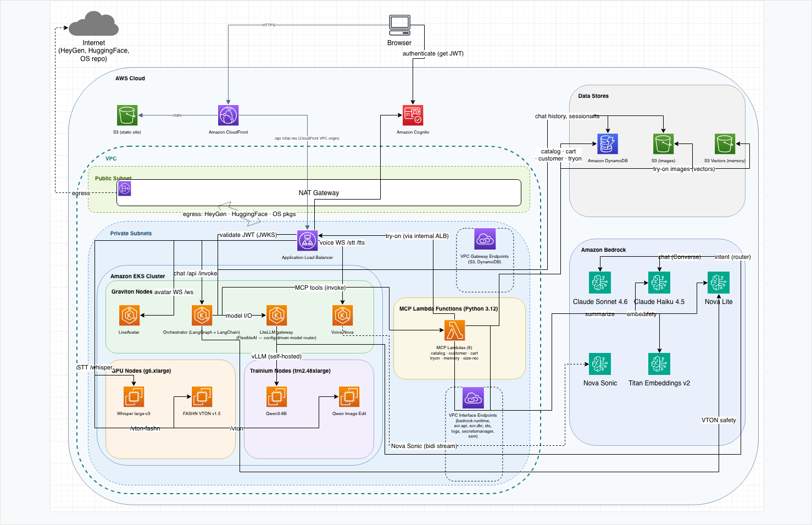

# Architecture

StoreAI is a modular, config-driven system deployed on Amazon EKS. This document describes how the
pieces fit together and the principles behind the design. For the reasoning behind specific choices,
see [design-decisions.md](design-decisions.md).

## Design principles

- **One-command deployable** — `deploy/storeai up` provisions everything, with sensible defaults.
- **Fully modular** — any component or subsystem (try-on, speech-to-text, LLM, avatar) deploys
  standalone; the deployer resolves and brings up its dependencies automatically.
- **Config-driven** — a single `storeai.config.json` drives the whole deployment. Adding or swapping
  an AI model is a configuration change, not a code change.
- **Terraform owns everything** except the user-provided Terraform state bucket.
- **Private by default** — all compute runs in private subnets; CloudFront is the only public ingress.

## System overview



The same topology in plain text (for quick reference in a terminal or diff):

```
                          Shopper (browser)
                                 |
                                 v
                   +---------------------------+
                   |        CloudFront         |   (only public ingress)
                   +---------------------------+
                     |            |          |
              static SPA      /api/*     /stt /tts /whisper (WebSocket)
                 (S3)            |          |
                                 v          v
                   +-------------------------------------------+
                   |        Internal ALB (private subnets)     |
                   +-------------------------------------------+
                                 |
        +------------------------+-----------------------------+
        |                 EKS cluster (private)                |
        |                                                      |
        |  Orchestrator (LangGraph)   Voice (Nova Sonic)       |
        |  Avatar (HeyGen)            Whisper STT (GPU)        |
        |                                                      |
        |  LiteLLM gateway  --->  L1 model servers:            |
        |    - Qwen Image-Edit (Trainium)                      |
        |    - FASHN try-on (GPU)                              |
        |    - Qwen3 LLM (Trainium)                            |
        +------------------------+-----------------------------+
                                 |
             +-------------------+--------------------+
             |                   |                    |
        MCP tools           Amazon Bedrock        Data plane
       (6 Lambdas)        (Claude, Nova Sonic)   (DynamoDB, S3, Cognito)
```

## Layered model

StoreAI separates generic model serving from application logic so that a model can be deployed and
queried on its own, and so that all prompts live with the product, not the model (see D-018).

| Layer | Responsibility | Examples |
|-------|----------------|----------|
| **L1 — model serving** | Generic, prompt-agnostic inference endpoints, usable standalone | `image-edit-model` (Qwen Image-Edit), `fashn-model`, `whisper`, `llm` (Qwen3) |
| **L2 — application / domain** | Product behavior: prompts, category/garment mapping, safety checks, branding, cost attribution, session logic | `orchestrator`, `vton`, `voice-nova`, `mcp-tools` |
| **L3 — AI gateway** | Single entry point and cost meter for all model calls | `litellm-gateway` |

## The unified AI gateway

Every model call — LLM chat, virtual try-on image generation, and speech-to-text — routes through a
single **LiteLLM gateway**. This gives one place to add or remove models (by config) and one place to
meter cost. The UI shows the cost of each interaction (with the model or engine labeled) and a session
total broken down by category.

The one documented exception is **Amazon Nova Sonic**: the voice service uses it for speech-to-text
and text-to-speech, and calls Bedrock directly over its bidirectional streaming API because the
gateway cannot proxy that stream. Nova Sonic cost is metered in the voice layer instead.

## Components

| Component | Layer | Runtime | Purpose |
|-----------|-------|---------|---------|
| `orchestrator` | L2 | EKS (Graviton) | LangGraph multi-agent chat; calls Bedrock Claude via the gateway |
| `mcp-tools` | L2 | Lambda (×6) | Catalog, customer, cart, try-on, size-rec, memory tools |
| `vton` (`tryon-mcp`) | L2 | Lambda (one of the 6 above) | Owns try-on prompts, garment mapping, safety, and engine selection |
| `voice-nova` | L2 | EKS (Graviton) | Nova Sonic speech-to-text and text-to-speech |
| `avatar-heygen` | L2 | EKS (Graviton) | Optional HeyGen animated avatar |
| `litellm-gateway` | L3 | EKS (Helm) | Unified AI gateway and cost meter |
| `image-edit-model` | L1 | EKS (Trainium) | Generic Qwen Image-Edit inference (preferred try-on engine when deployed) |
| `fashn-model` | L1 | EKS (GPU) | FASHN virtual try-on inference |
| `whisper` | L1 | EKS (GPU) | Whisper large-v3 speech-to-text |
| `llm` | L1 | EKS (Trainium) | Self-hosted Qwen3 via vLLM |
| `frontend` | edge | S3 + CloudFront | Static Next.js app |

## Compute

StoreAI runs a **hybrid** EKS cluster (see D-040):

- **General services** (orchestrator, voice, avatar, gateway) run on **EKS Auto Mode** using
  Graviton (arm64) nodes that scale automatically.
- **Accelerated workloads** run on **managed node groups**: NVIDIA GPU (`g6`) for Whisper and FASHN,
  and AWS Trainium (`trn2`) for the self-hosted LLM and Qwen Image-Edit models.

Auto Mode alone could not reliably serve the accelerator device plugins (GPU time-slicing and Neuron
allocation), so accelerators moved to managed node groups where StoreAI controls the driver and
device-plugin stack. See D-039 and D-040 for the empirical findings.

## Resource efficiency

Accelerators are the most expensive resources, so StoreAI is deliberate about packing them
efficiently (see decisions D-039 and D-040):

- **GPU time-slicing — smaller models share one GPU.** A self-hosted NVIDIA device plugin with
  time-slicing lets FASHN try-on and Whisper speech-to-text run together on a single `g6.xlarge`
  instead of one instance each. This runs on the **GPU managed node group**, not EKS Auto Mode —
  time-slicing is incompatible with Auto Mode's managed device plugin (D-039).
- **Neuron scheduling.** On the Trainium managed node group, a Neuron device plugin and scheduler
  place pods by available Neuron cores, bin-packing models onto the reserved capacity block.
- **Scale-to-zero.** Idle accelerator workloads scale down when unused — the primary GPU cost lever.
- **Compile once, cache in S3.** Compiled Neuron artifacts are cached in S3 so replacement nodes reuse
  them instead of recompiling (~30–45 min saved per model).
- **Graviton autoscaling.** General services run on EKS Auto Mode Graviton nodes that scale with load.

**Why not DRA?** Kubernetes Dynamic Resource Allocation (DRA) is the natural fit for fine-grained
device sharing and was evaluated — but it is **not supported on EKS Auto Mode or Karpenter**, and
GPU time-slicing does **not** work under Auto Mode's managed device plugin (both verified empirically,
D-039/D-040). StoreAI therefore runs accelerators on **managed node groups** where it controls the
device-plugin stack, which is exactly what makes the time-slicing co-location above possible.

## Network topology

- All compute runs in a custom VPC across two Availability Zones, on **private subnets**.
- **CloudFront is the only public ingress.** It fronts an **internal ALB** through CloudFront VPC
  origins, and serves the static frontend from S3.
- AWS service access is private: **gateway endpoints** for S3 and DynamoDB, **interface endpoints**
  for Bedrock, ECR, STS, CloudWatch Logs, Secrets Manager, and SSM.
- A single **NAT gateway** provides outbound egress for external dependencies (HeyGen, public
  container images, model downloads).

## Request routing

CloudFront routes by path:

| Path | Origin | Notes |
|------|--------|-------|
| `/` and static assets | S3 | The Next.js static export |
| `/api/*` | Internal ALB → orchestrator | The `/api` prefix is stripped at the edge |
| `/images/*` | Internal ALB → orchestrator | Public product images |
| `/tryon-images/*`, `/tryon-results/*` | Internal ALB → orchestrator | Customer photos and results (authenticated) |
| `/stt`, `/tts`, `/whisper`, `/ws` | Internal ALB | WebSocket routes for voice and avatar |

## Data plane

| Store | Type | Purpose |
|-------|------|---------|
| products, customers, carts, orders | DynamoDB | Catalog and shopping state |
| tryon-room, memory, sessions, checkpoints, share-tokens | DynamoDB | Try-on queue, conversation memory/history, and QR share tokens |
| product images | S3 | Served publicly via CloudFront |
| try-on photos and results | S3 | Customer uploads and generated images (authenticated) |
| frontend assets | S3 | Static site origin |
| Cognito user pool | Cognito | Authentication |

DynamoDB tables use `snake_case` keys matching the application code.

## Virtual try-on flow

Try-on is the most involved path and illustrates the layered model:

1. The `vton` L2 app receives the request, resolves the garment category to a body region, and
   builds the model-specific prompt.
2. It calls the selected L1 engine — FASHN by default, or Qwen Image-Edit when the self-hosted `image-edit-model` module is deployed — through the gateway.
3. The generated image is verified for content safety with Amazon Nova Lite. If the primary engine's
   output is flagged, the app falls back to FASHN and re-verifies.
4. If no safe image can be produced, the app returns a generic content-review message.

Content verification is modular (`components/orchestrator/app/vton_verify.py`) and can be toggled with
`VTON_SAFETY_ENABLED` (default on) and pointed at a different verifier model with
`VTON_SAFETY_MODEL_ID`.

## Security

Authentication (two-layer Amazon Cognito), private-by-default networking, least-privilege IAM,
data protection, and generated-image content safety are described in [security.md](security.md).

## Conversation and prompt architecture

### Orchestration framework: LangGraph + LangChain

The orchestrator is built on **LangGraph** (using **LangChain** primitives). Rather than a single
LLM call, the agent is a **LangGraph `StateGraph`** — a directed graph of nodes over a typed
conversation state (`components/orchestrator/app/graph.py`). This is what gives the assistant its
multi-step structure: nodes handle intent routing, the tool-calling agent loop (calling the MCP
tools), guardrails, and response composition, and a **checkpointer** carries conversation state
across turns. **LangChain** (`langchain_core`) supplies the message and type primitives the graph
passes between nodes.

Model calls themselves go out through the **LiteLLM gateway** (not LangChain's own provider
integrations), so the chat model stays swappable by configuration. In short: **LangGraph orchestrates
the agent's control flow and state; LangChain provides the message primitives; LiteLLM handles the
actual model I/O.**

### System prompt assembly

The orchestrator is a LangGraph agent. Each turn assembles a system prompt from composable parts
(`components/orchestrator/app/prompts.py`, `build_system_prompt`):

- **`COMMON_PROMPT`** — the assistant's persona and store-wide rules, always included.
- **Mode prompt** — `STANDARD_MODE_PROMPT` for the normal web experience, or the booth-mode prompts
  (`BOOTH_SHOPPING_PROMPT` / `BOOTH_TRYON_PROMPT`) for kiosk stations.
- **Stage guidance** — a directed conversation funnel; `STAGE_DESCRIPTIONS` adds guidance for the
  current stage (greet, discover, browse, shortlist, commit, …).
- **Intent guidance** — a lightweight intent router (a fast model, `ROUTER_MODEL`) classifies the
  turn, and `_get_intent_guidance` appends intent-specific instructions.

The assembled prompt plus the tool definitions go to the chat model (`CHAT_MODEL`) through the
gateway. Tool calls are dispatched to the MCP Lambdas.

### Long-term customer memory (Amazon S3 Vectors)

Signed-in customers get **long-term memory** that persists across sessions — the assistant recalls
what a returning shopper liked, disliked, their sizes, and past purchases, and personalizes
accordingly.

- **Storage.** Memories are stored two ways by the `memory-mcp` Lambda:
  - **Amazon S3 Vectors** — a cost-optimized, serverless vector store (no idle compute floor). Each
    memory's text is embedded with **Amazon Titan Text Embeddings v2** (1024-dim) and indexed for
    semantic search (cosine). `customer_id`, `kind`, and `created_at` are filterable metadata; the
    memory `text` is stored as non-filterable metadata.
  - **Amazon DynamoDB** (`memory` table) — the durable system of record and a recency fallback if a
    vector query fails or no query text is available.
- **Write — on session end.** When a session ends (a `[CHECKOUT_COMPLETE]` or `[LOGOUT]` marker, or an
  explicit `POST /end_session` from the frontend), the orchestrator calls `summarize_session`, which
  uses a fast model (Claude Haiku) to distil the conversation into 2–3 salient bullets (wanted /
  liked / disliked / sizes / purchased) and writes that as a `session_summary` memory. Trivial
  sessions summarize to nothing and are not stored.
- **Read — per turn.** For signed-in customers, the graph's `memory_read` node semantically queries
  the customer's memories using the current message, and the top 3 are injected into the system
  prompt as a "what we remember about this returning customer" block. Retrieval is best-effort — a
  memory error never blocks the turn. Guests have no long-term memory.
- **Why S3 Vectors.** Memory access is sparse (one read per turn, a write per session) and small in
  scale, which is exactly S3 Vectors' cost sweet spot: pay-per-use with no always-on cost, versus an
  hourly OCU floor for OpenSearch Serverless. The added query latency (~100–400 ms) is negligible in
  front of a multi-second LLM turn. See D-043 in `design-decisions.md`.
- **Infrastructure.** The vector bucket and index are Terraform-managed (`memory-search` module) so
  `down`/`destroy` removes them cleanly along with everything else.

## Cost model

Cost shown in the UI is an **estimate of AI-inference cost**, not your AWS bill.

- The orchestrator computes per-call cost in `llm_client.calc_cost(model, input_tokens,
  output_tokens, tool_calls)` from a config-driven price table keyed by gateway model, returning
  `{ llm: {model, label, usd}, infra: {usd}, total_usd }`.
- The frontend accumulates these into a **session total broken down by category** — chat (LLM),
  try-on (VTON), and speech-to-text — plus a separate, clearly labeled **infrastructure estimate**
  (a rough per-turn figure for Lambda/DynamoDB, not real billing).
- Try-on cost comes from the engine response; **Nova Sonic** cost is metered in the voice layer
  because it bypasses the gateway (see the gateway exception above).

Price tables are configuration-driven, so adjusting a model's price is a config change.

## Try-on code paths (known duplication)

Two code paths currently generate try-ons, and this is a known area for consolidation:

1. **Streaming chat path** — `_exec_vton_direct` in the orchestrator (`main.py`) runs the try-on
   inline during a `/chat/stream` turn.
2. **REST path** — the `/virtual_try_on` endpoint in the same service.

Both build the engine request through the shared `vton_engines` package and verify the result with
`vton_verify`, so behavior matches — but the logic is duplicated. A third, older implementation exists
in the `tryon-mcp` Lambda but is currently bypassed. Consolidating these into a single shared helper is
tracked as follow-up work.

## Modules

Modules are declared in `deploy/config/registry.yaml` with their layer, kind, and dependencies. The
deployer topologically sorts enabled modules and auto-enables required dependencies.

| Deploy this | Command | Brings up |
|-------------|---------|-----------|
| Full store | `storeai up` | Core store + gateway + try-on + voice |
| Generic image-edit model | `storeai up --module image-edit-model` | EKS + gateway + the model |
| Try-on only | `storeai up --module vton` | Data plane + tools + gateway + an engine + vton |
| Speech-to-text only | `storeai up --module whisper` | EKS + gateway + whisper |
| Self-hosted LLM | `storeai up --module llm` | EKS (Trainium) + gateway + the model |
| HeyGen avatar | `storeai up --module avatar-heygen` | EKS + avatar (needs a HeyGen key) |

## Infrastructure as code

All AWS resources are Terraform modules under `infra/terraform/modules/`:

| Module | Provisions |
|--------|-----------|
| `network` | VPC, subnets, NAT, VPC endpoints |
| `eks` | EKS cluster (Auto Mode + managed node groups), IAM |
| `data-plane` | DynamoDB, S3, Cognito, SSM |
| `ecr` | Container image repositories |
| `lambdas` | The six MCP tool functions |
| `memory-search` | Amazon S3 Vectors bucket + index for long-term customer memory |
| `cdn` | CloudFront distribution and edge functions |

Because CloudFront's VPC origin needs a real ALB (created by the Kubernetes ingress), `deploy/storeai`
applies Terraform in **two passes**: everything except the CDN first, then the CDN after the cluster
ingress exists. See D-041.
